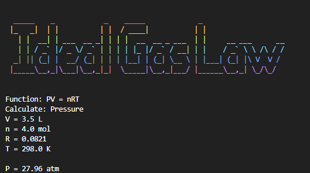

# Ideal Gas Law command-line


This is a command-line tool that can calculate the ideal gas formula. 

> [!WARNING]
> This script is currently under development.
> If you encounter any bugs or errors, you can report them through a pull request.

## How to run ?? 💻
```python
python main.py
```
> [!NOTE]
> Python version 3.9 or higher

## Example Answer ✍️




# © Narngisa - 2024